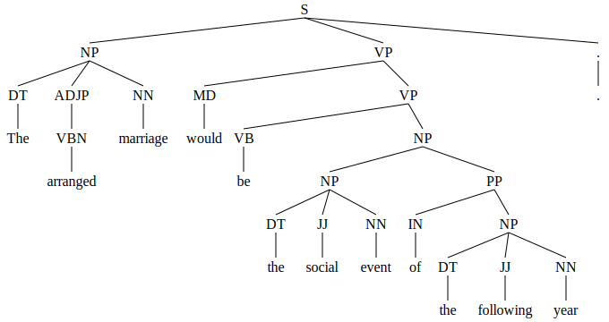
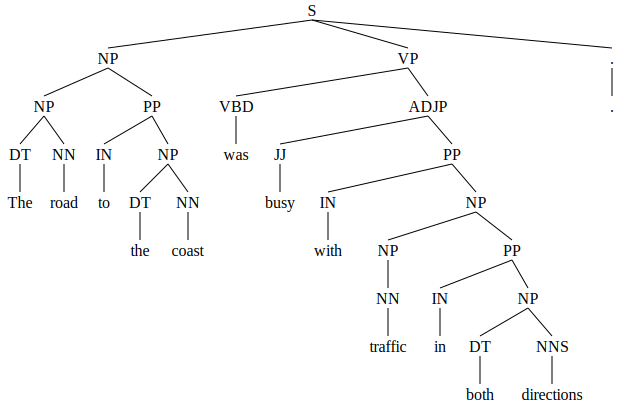

# L95 Assignment

### Parser Outputs

Ctrl/Cmd+Click on each image to open the full-size version in a new tab.

| Sentence | Original Gold Standard (top), Modified Gold Standard (bottom) | CoreNLP | Berkeley Neural Parser |
|----------|-------------------------------------------------|---------|-------------------------|
| **1.** "As she walked past it, the driver's glass started to open." |   |  |  |
| **2.** "With a handkerchief she wiped the sweat from her forehead." |   |  |  |
| **3.** "Prudently, they had diversified into banking and insurance, and as a result their influence was felt at the highest level." |   |  |  |
| **4.** "The arranged marriage would be the social event of the following year." |   |  |  |
| **5.** "When at last she spoke, her words were heavy and disjointed." |   |  |  |
| **6.** "The road to the coast was busy with traffic in both directions." |   |  |  |
| **7.** "The expected date came and went." |   |  |  |
| **8.** "She sighed at the irony of it all, the waste of it all." |   |  |  |
| **9.** "All through August the rain hardly stopped." |   |  |  |
| **10.** "Thank the gods he didn't have to know of this." |   |  |  |

### Structure

- `gold_standard/`
    - `gold_standard.txt`:
        - This file contains the provided gold standard data.
        - **Formatting changes made to `gold_standard.txt`**:
            - The typo in the token "leve" in the bracketed constituency tree of Sentence 3 was corrected to "level".
            - A full stop node was added to the end of the bracketed constituency tree of Sentence 3 (as per the provided PoS tag annotation).
            - The node "didn't" in Sentence 10 was split into "did" and "n't" (as per the provided token and PoS tag annotations).
    - `modified_gold_standard.txt`:
        - This file contains the modified gold standard parses after applying all of the changes listed in Section 3 of the report.
    - `gold_standard_loader.py`
        - This file parses the gold standard data into Python objects.
        - Pre-processing constituency trees:
            - The provided constituency trees omit the PoS tags of each token.
                - The `Sentence`'s `ConstituencyParse` object contains a function `annotate_leaves` that deepens `nltk_tree` by one level, adding in the PoS tag of each leaf node.

- `parser_loader/`
    - `constituency/`
        - `parser.py`
            - This file contains Python objects to load and parse a set of sentences from:
            1. Stanford's CoreNLP unlexicalised constituency parser
            2. Stanford's Stanza constituency parser
            3. Berkeley's constituency parser
            4. Berkeley's Neural constituency parser (Benepar)
            - The head `TOP`/`ROOT` nodes are removed from the generated constituency trees to match the format of the gold standard trees.
    - `dependency/`
        - `parser.py`
            - This file contains Python objects to load and parse a set of sentences from:
            1. Spacy's dependency parser

- `experiments.py`
    - This file contains the code to run each gold standard sentence through the constituency and dependency parsers, and visualise/evaluate their generated results.

- `parser_tools/`
    - This directory contains the downloaded parser tools.
    - These are omitted from the repository due to large model sizes.
    - To run Stanford's CoreNLP parser:
        - Download the zip file from [here](https://stanfordnlp.github.io/CoreNLP/download.html) (version 4.5.8) and extract it to this (`parser_tools/`) directory.
        - Then execute the following command from this directory:
            ```bash
            java -mx4g -cp "*" edu.stanford.nlp.pipeline.StanfordCoreNLPServer -status_port 9000 -port 9000 -timeout 15000
            ```
            This will start the Stanford CoreNLP server on port 9000, and the parser loader will connect to it to parse the gold standard sentences.

- `parser_output/`
  - This directory contains the bracketed constituency trees returned as output by both the CoreNLP and Berkeley Neural parsers. The bracketed parses of the modified gold standard are also included here. These trees are organised by parser and sentence number.
  - Inside this directory also includes a `evalb_results/` directory, which contains the `evalb` results of the generated parses against the gold standard parses for each sentence.

- `experiments/`
  - This directory contains the results of the experiments performed in Section 4.2 titled "Multi-word Phrases" and Section 4.3 titled "Pre-Processing: PoS Tags". The directories corresponding to these experiments have their own `README.md` files.

- `evaluation_tools/`
    - `evaluation.py`
    This file contains code to evaluate the generated parses.
        - [`PYEVALB`](https://pypi.org/project/PYEVALB/), a Python implementation of [`evalb`](https://nlp.cs.nyu.edu/evalb/), is used to evaluate constituency parses.
