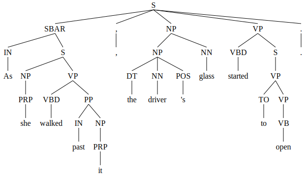
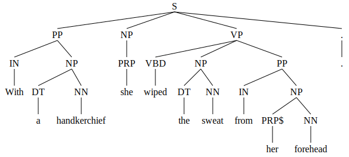
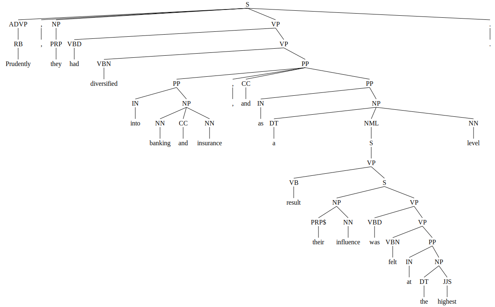
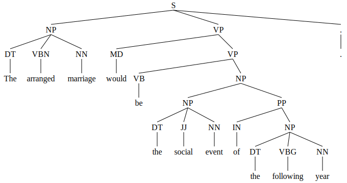
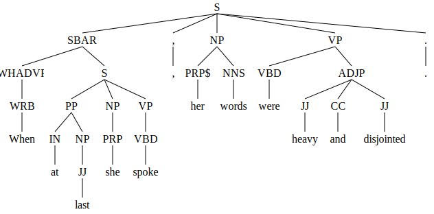
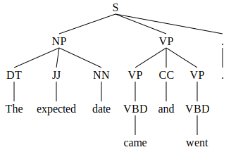
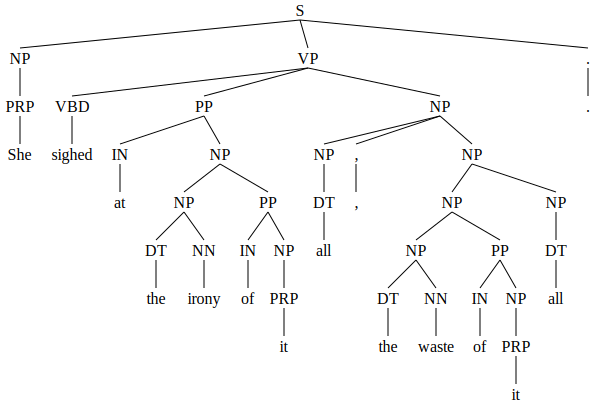
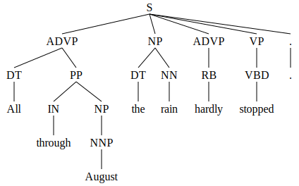

# Parser Outputs

The images below display the parse tree of the modified gold standard, and the parse trees generated by Berkeley Neural Parser and CoreNLP. Simply click on each image to view it enlarged.

Sentence 1: "As she walked past it, the driver's glass started to open."

| Gold Standard | Berkeley Neural Parser | CoreNLP |
|---------------|-------------------------|---------|
|  |  |  |

Sentence 2: "With a handkerchief she wiped the sweat from her forehead."

| Gold Standard | Berkeley Neural Parser | CoreNLP |
|---------------|-------------------------|---------|
|  |  |  |

Sentence 3: "Prudently, they had diversified into banking and insurance, and as a result their influence was felt at the highest level."

| Gold Standard | Berkeley Neural Parser | CoreNLP |
|---------------|-------------------------|---------|
|  |  |  |

Sentence 4: "The arranged marriage would be the social event of the following year."

| Gold Standard | Berkeley Neural Parser | CoreNLP |
|---------------|-------------------------|---------|
|  |  |  |

Sentence 5: "When at last she spoke, her words were heavy and disjointed."

| Gold Standard | Berkeley Neural Parser | CoreNLP |
|---------------|-------------------------|---------|
|  |  |  |

Sentence 6: "The road to the coast was busy with traffic in both directions."

| Gold Standard | Berkeley Neural Parser | CoreNLP |
|---------------|-------------------------|---------|
|  |  |  |

Sentence 7: "The expected date came and went."

| Gold Standard | Berkeley Neural Parser | CoreNLP |
|---------------|-------------------------|---------|
|  |  |  |

Sentence 8: "She sighed at the irony of it all, the waste of it all."

| Gold Standard | Berkeley Neural Parser | CoreNLP |
|---------------|-------------------------|---------|
|  |  |  |

Sentence 9: "All through August the rain hardly stopped."

| Gold Standard | Berkeley Neural Parser | CoreNLP |
|---------------|-------------------------|---------|
|  |  |  |

Sentence 10: "Thank the gods he didn't have to know of this."

| Gold Standard | Berkeley Neural Parser | CoreNLP |
|---------------|-------------------------|---------|
|  |  |  |

