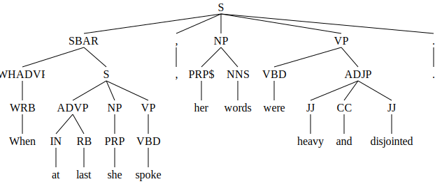
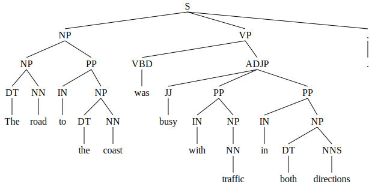
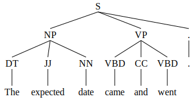
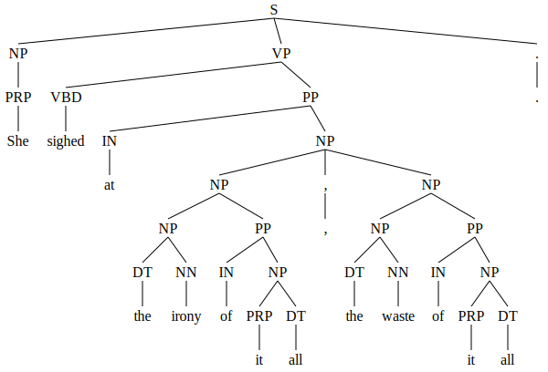
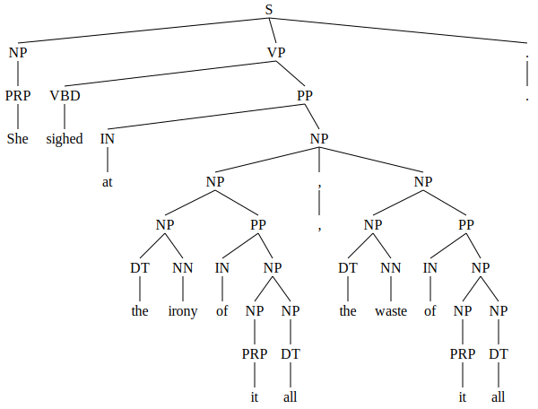
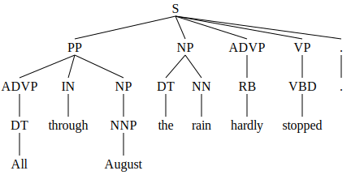
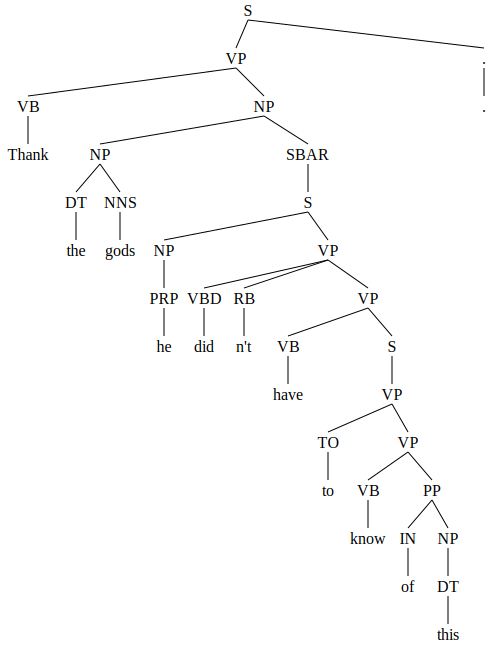
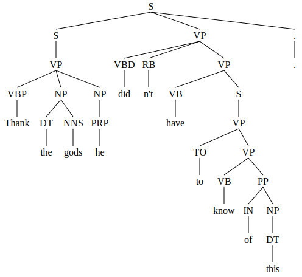

# Parser Outputs

The images below display the parse tree of the modified gold standard, and the parse trees generated by Berkeley Neural Parser and CoreNLP. Each set of images is placed side by side for comparison.

Sentence 1

| Gold Standard | Berkeley Neural Parser | CoreNLP |
|---------------|-------------------------|---------|
|  |  |  |

Sentence 2

| Gold Standard | Berkeley Neural Parser | CoreNLP |
|---------------|-------------------------|---------|
|  |  |  |

Sentence 3

| Gold Standard | Berkeley Neural Parser | CoreNLP |
|---------------|-------------------------|---------|
|  |  |  |

Sentence 4

| Gold Standard | Berkeley Neural Parser | CoreNLP |
|---------------|-------------------------|---------|
|  |  |  |

Sentence 5

| Gold Standard | Berkeley Neural Parser | CoreNLP |
|---------------|-------------------------|---------|
|  |  |  |

Sentence 6

| Gold Standard | Berkeley Neural Parser | CoreNLP |
|---------------|-------------------------|---------|
|  |  |  |

Sentence 7

| Gold Standard | Berkeley Neural Parser | CoreNLP |
|---------------|-------------------------|---------|
|  |  |  |

Sentence 8

| Gold Standard | Berkeley Neural Parser | CoreNLP |
|---------------|-------------------------|---------|
|  |  |  |

Sentence 9

| Gold Standard | Berkeley Neural Parser | CoreNLP |
|---------------|-------------------------|---------|
|  |  |  |

Sentence 10

| Gold Standard | Berkeley Neural Parser | CoreNLP |
|---------------|-------------------------|---------|
|  |  |  |

