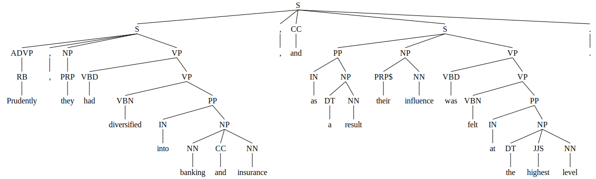
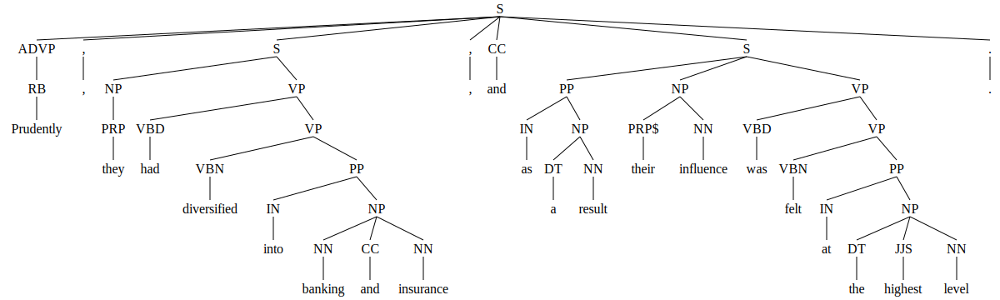
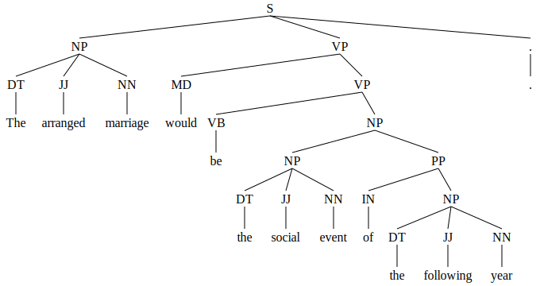
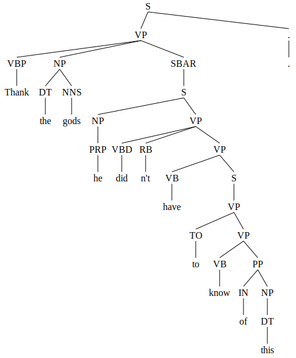

# Parser Outputs

The images below display the parse tree of the modified gold standard, and the parse trees generated by Berkeley Neural Parser and CoreNLP. Each image is placed side by side for comparison.

Sentence 1

    

        
        
Gold Standard

    

    

        
        
Berkeley Neural Parser

    

    

        
        
CoreNLP

    

Sentence 2

    

        
        
Gold Standard

    

    

        
        
Berkeley Neural Parser

    

    

        
        
CoreNLP

    

Sentence 3

    

        
        
Gold Standard

    

    

        
        
Berkeley Neural Parser

    

    

        
        
CoreNLP

    

Sentence 4

    

        
        
Gold Standard

    

    

        
        
Berkeley Neural Parser

    

    

        
        
CoreNLP

    

Sentence 5

    

        
        
Gold Standard

    

    

        
        
Berkeley Neural Parser

    

    

        
        
CoreNLP

    

Sentence 6

    

        
        
Gold Standard

    

    

        
        
Berkeley Neural Parser

    

    

        
        
CoreNLP

    

Sentence 7

    

        
        
Gold Standard

    

    

        
        
Berkeley Neural Parser

    

    

        
        
CoreNLP

    

Sentence 8

    

        
        
Gold Standard

    

    

        
        
Berkeley Neural Parser

    

    

        
        
CoreNLP

    

Sentence 9

    

        
        
Gold Standard

    

    

        
        
Berkeley Neural Parser

    

    

        
        
CoreNLP

    

Sentence 10

    

        
        
Gold Standard

    

    

        
        
Berkeley Neural Parser

    

    

        
        
CoreNLP

    

